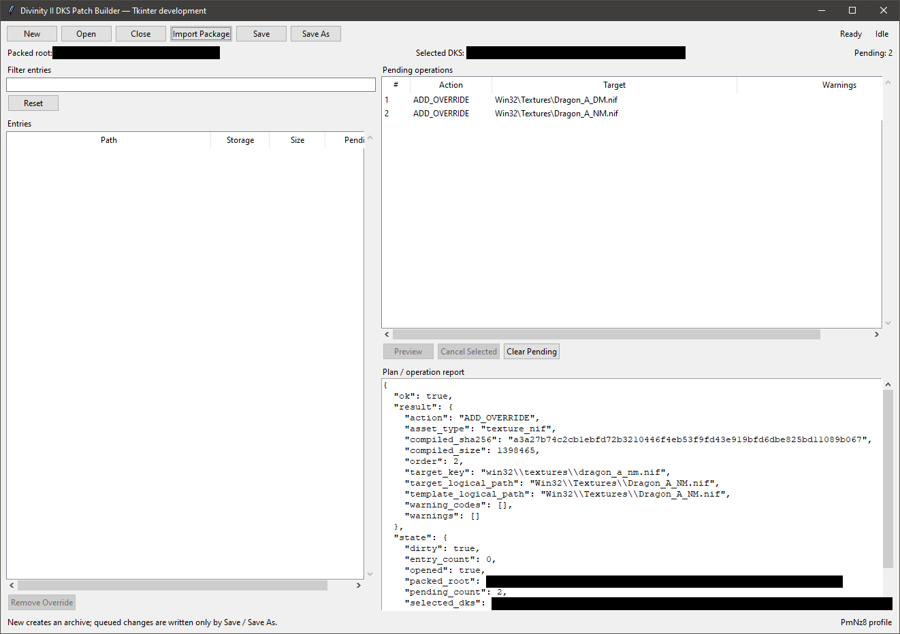
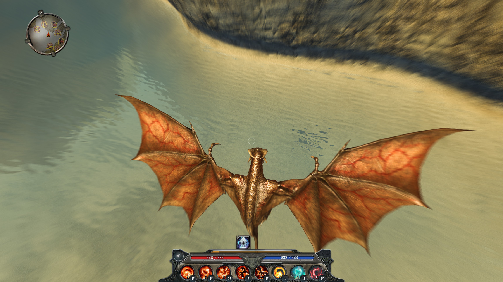

# Divinity II DKS Patch Builder 0.2.0.dev0

An experimental Windows x64 tool by [PmNz8](https://github.com/PmNz8) for building
texture modifications and fixed-profile narrative bundles in `DKS_Patch.dv2` archives.

This development version adds Quest Author's new-FoV Beata/Hansel package type.
It is not a published release; the existing 0.1.0 release remains texture-only.

Built around the game's patch-archive loading mechanism, DKS Patch Builder
keeps supported texture replacements in a dedicated `DKS_Patch.dv2` — so you
can change the game's look without repacking its original asset archives.

Developed and tested exclusively with the **GOG edition of Divinity II:
Developer's Cut**. Compatibility with other editions or storefront versions
has not been verified.

## What it does

- Imports **Builder Packages** exported by [Texture Viewer](https://github.com/PmNz8/divinity2-texture-viewer).
- Compiles edited BC1/BC3 textures; unchanged BC2 packages are also supported.
- Creates or opens a DKS archive, queues changes and shows their targets/warnings.
- Saves to a new archive or updates the selected DKS with one previous-file backup.

- Imports `narrative.fov_debt.v1` packages from Quest Author as one five-resource group.
- Validates the recognized pristine source corpus; rejects narrative conflicts,
  partial groups and unsupported source versions.

Narrative imports require a new empty DKS outside Packed and an empty queue.
They cannot be mixed with other packages or used to upgrade an existing quest.
The tool does not install mods, generate mip levels or create game references
for newly named textures. New narrative game-runtime acceptance is separate from
the verified local GUI/package/archive workflow.

## Start

Extract the entire Windows ZIP and run **DKSPatchBuilder.exe**. No separate
Python, .NET or WebView2 installation is required. The executable is unsigned.

See **[USAGE.md](USAGE.md)** for the complete workflow, safety rules and limits,
or **[BUILD.md](BUILD.md)** to build the matching source package.

## Examples

Earlier development interface

In-game example of changed textures

The screenshots are illustrative, not raw game assets. Depicted game content
remains the property of its respective rights holders. This tool is not
affiliated with the game developer or publisher.

## License

Copyright (C) 2026 PmNz8. Own code: **AGPL-3.0-only**; see [LICENSE](LICENSE),
[THIRD_PARTY_NOTICES.md](THIRD_PARTY_NOTICES.md) and [LICENSES](LICENSES).
Provided without warranty. Using this tool does not automatically put exported
content under AGPL, override existing content licenses or grant permission to
redistribute game assets. Mod authors retain rights to their own original
contributions to the extent they hold those rights.
